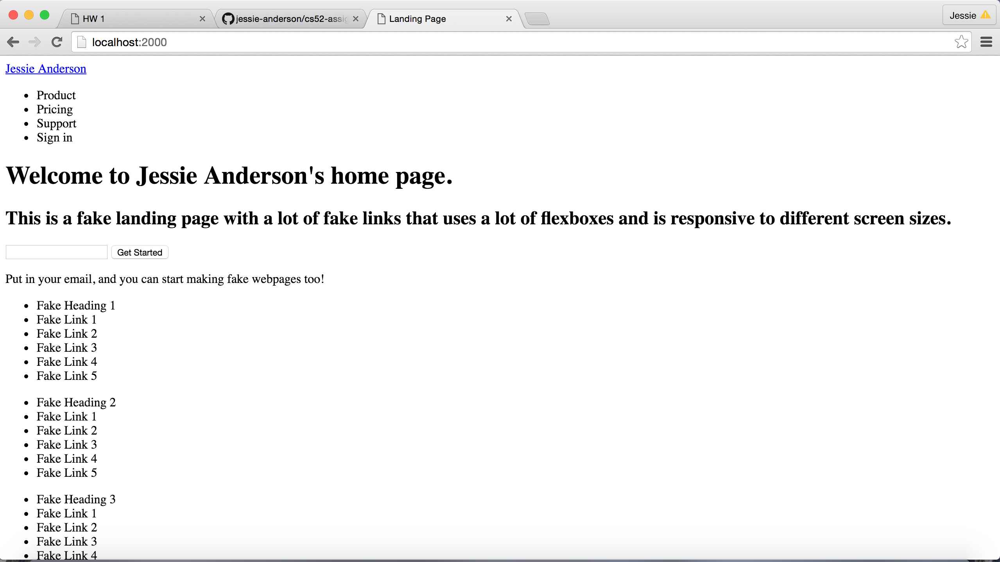
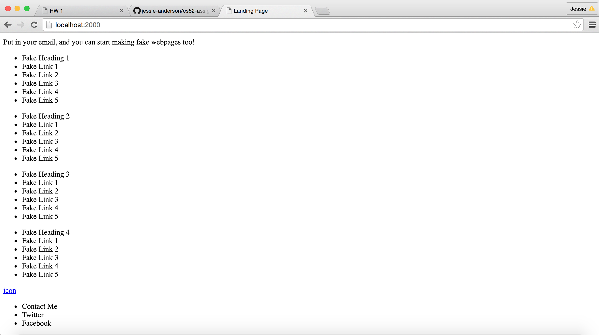
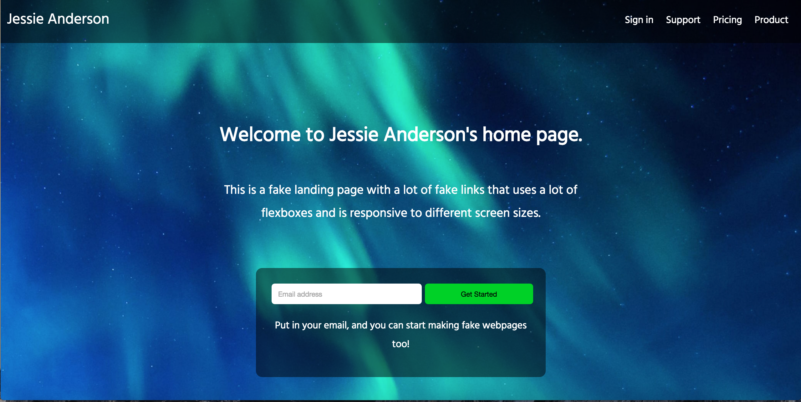
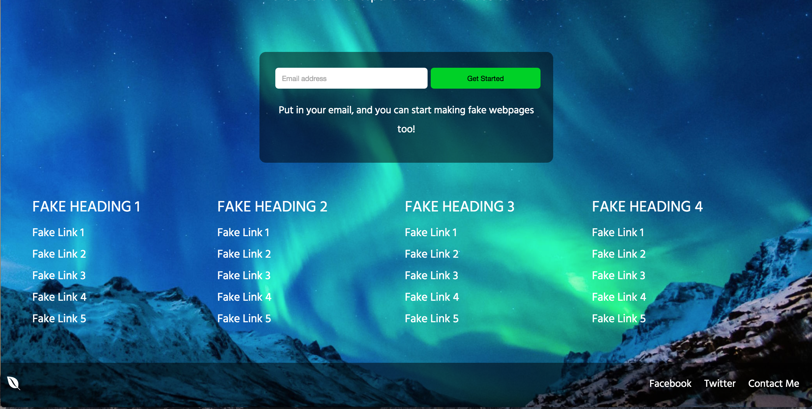
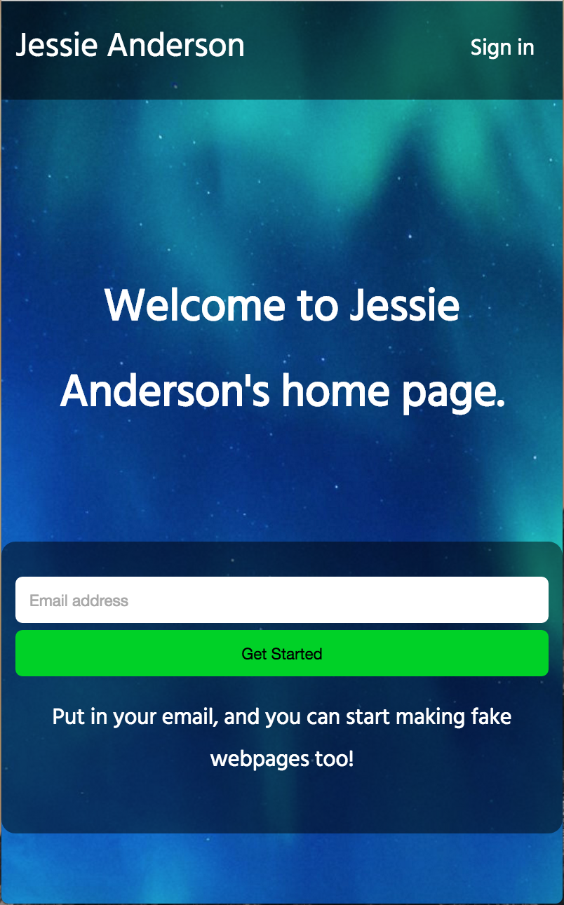
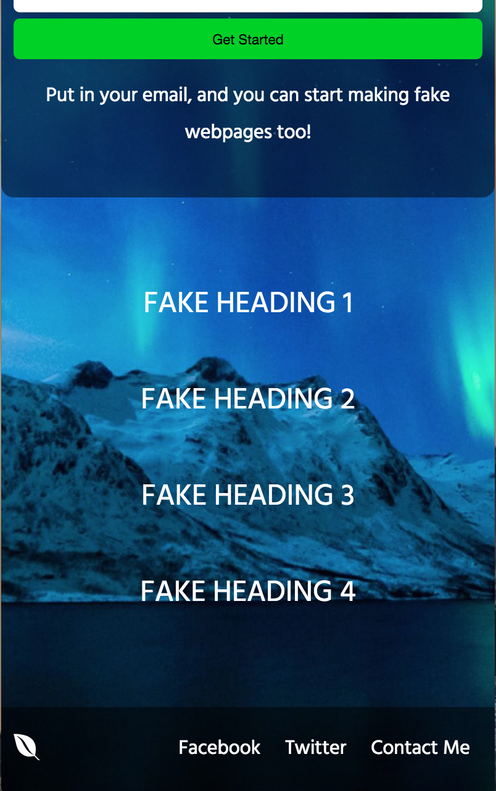
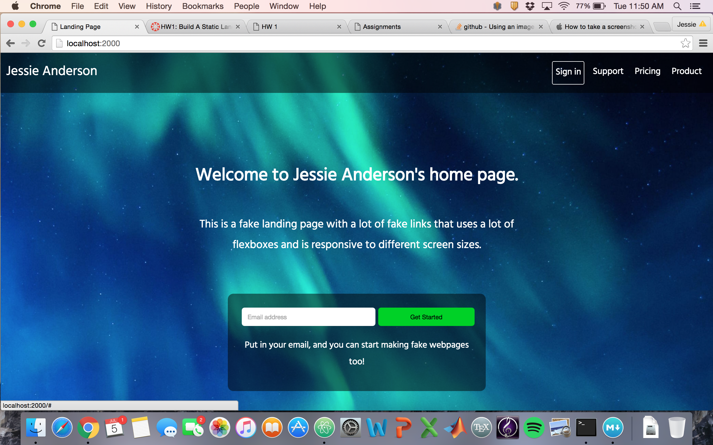

#Assignment 1, CS52
##Author: Jessie Anderson
##Date: July 5, 2016

###Description

I made a landing page with several "fake" links. The page responds to media queries by changing its layout for mobile and desktop-size screens: it cuts content and changes layout when transitioning from mobile to desktop. For example, on mobile, the user must click on the headings to expand the link lists, while the links are simply displayed under the headings on desktop.

The most difficult part was figuring out the formatting of the email input box and "get started" button. The design went through several phases, and while the final phase is not perfect, it is the best of the various stages. Also, the "checkbox hack" was somewhat tough to figure out, but after looking at several examples, I was able to adapt the technique to serve my needs.

Also, the link expand transition doesn't work nicely on mobile: it's instantaneous instead of using the transition timing function specified. However, the transition works on desktop.

###Layout

The following is the layout - pure HTML, no CSS:

Top of page:

Bottom of page:

###Features

Here are screen caps/gifs of a few page features:

**Desktop vs. mobile**

Desktop top:

Desktop bottom:

Mobile top:

Mobile bottom:

**Menu hover**

See top right corner, "Sign in":

**Expandable list on mobile**

